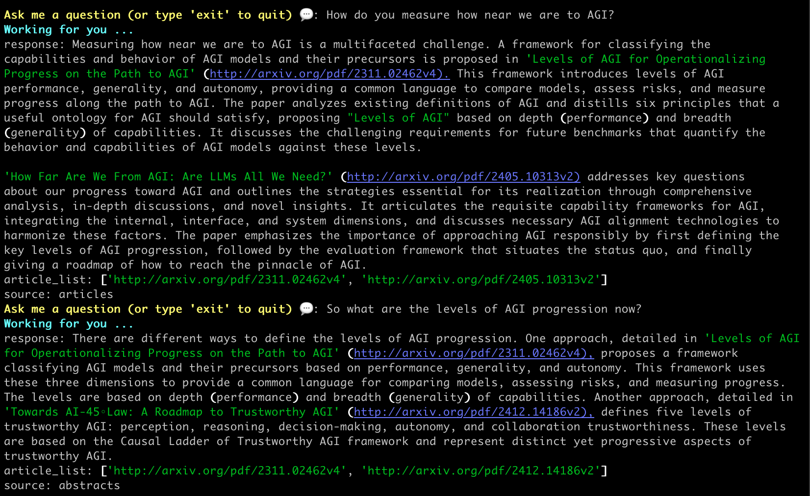

<p align="center"></p>

<h1 align="center">

Askademic


</h1>

# What is this

Askademic is an AI agent that helps you with finding information in research papers. It queries the arXiv API and can:
* summarise the latest papers in a category/subcategory for you
* answer questions by retrieving relevant papers and searching within them to produce an answer
* answer questions regarding a specific paper you are interested in
It also allows you to have a conversation, that is, to ask for follow-up questions.

As for everything that uses LLM, check your outputs - it can male mistakes. The tool is designed to provide short answers and suggestions, leaving to the user the effort to dive deeper into the matter.

And, it has an eye for things non-scientific... see below.

It works as a CLI tool.

Askademic uses Google Gemini 2.0 as its underlying LLM. We aim to expand it to allow for multiple LLMs in the (near) future, especially open ones, but this early choice has been motivated by some factors:
* it has a free tier - we wrote the agent in such a way to privilege cost-effectiveness over speed, which means for short conversations you should be within the quotas of the free tier
* it has a very large context window, very useful for questions where extensive searches over many papers are needed
* it works pretty well for this use cases

Askademic is built on [PydanticAI](https://ai.pydantic.dev/) as its agents framework.

# Requirements

Works with Python 3.11 and above. Currently in beta, not yet published on PyPI.

# Installation & setup

1. Clone this repo
2. `cd` into it and pip install it as `pip install .` Alternatively, you can `pip install` from the GitHub link. Or, use `uv` with `uv tool install --python python3.11 .` — this lets you choose the exact Python version for your environment, which is useful for testing or compatibility.
3. Then, you need a Gemini API key. Head to [Google AI Studio](https://aistudio.google.com/app/apikey) to generate it and run
4. Set the env var for it

You can use
```
export GEMINI_API_KEY=your-api-key
```

This will only persist your API key to the session. To persist it globally you need to add it to your bash/ZSH profile.

Note: Gemini has a good free tier, and askademic has been designed in such a way to not exceed its quotas - for typical use this'll be the case.

# Run it

You just run it with command `askademic` from the terminal.

# Examples

### When you ask for a summary of latest papers


### When you ask questions - with and without follow-up



</details>

<details>
<summary>When you ask a question or details about a specific article</summary>


</details>

### When you ask something non-scientific, you deserve a pun!


# Roadmap and issues

This is a beta. If you see this, please try it and give us feedback. If you find quirks or something that is not great, you are more than welcome to open an issue in this repo, please describe the issue clearly, ideally with screenshots.

We have several ideas to develop this further, adding new capabilities and features, so stay tuned!

# Acknowledgments

Thank you to arXiv for use of its open access interoperability. This [service/ product] was not reviewed or approved by, nor does it necessarily express or reflect the policies or opinions of, arXiv.

# Licence

2025 - GNU General Pubic License v3
